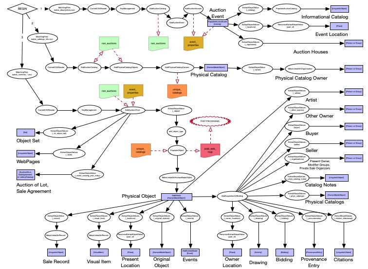
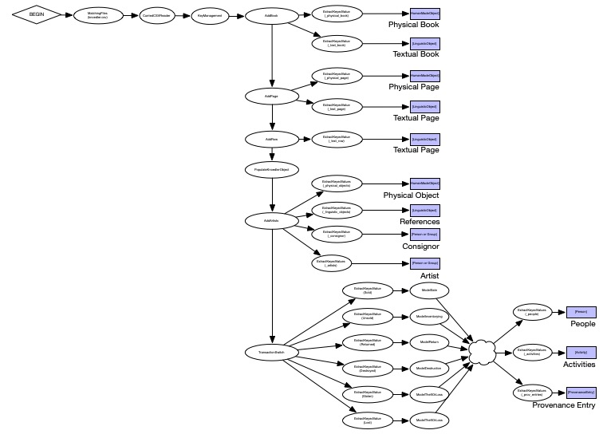
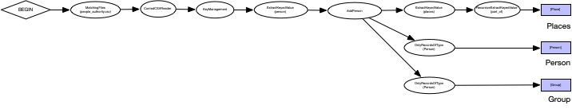
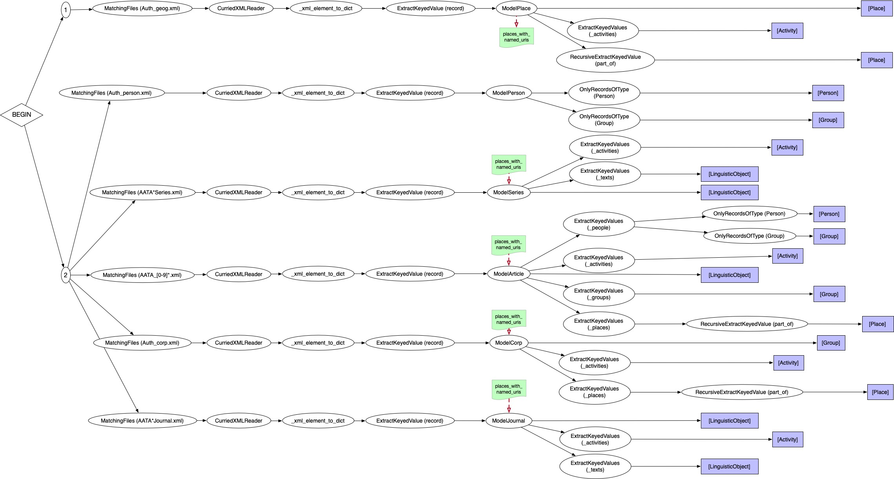

# Getty Linked Data Transformation Pipeline

## Table of Contents

* [Table of Contents](#table-of-contents)
* [Pipeline Infrastructure](#pipeline-infrastructure)
* [Code and File Organization](#code-and-file-organization)
* [Projects](#projects)
    * [Provenance Index](#provenance-index)
        * [Sales](#sales)
        * [Knoedler](#knoedler)
        * [People](#people)
    * [AATA](#aata)
* [Tooling and Post-pipeline Processing](#tooling-and-post-pipeline-processing)

## Pipeline Infrastructure

The implementation of the pipeline is designed around the [Bonobo](https://www.bonobo-project.org) framework.
This provides an API for describing data transformation as a data flow graph which each node is a function or class that when invoked accepts a single record as input and emits zero or more output records.
These nodes are connected so that the modeling of data is built up from initial records (either a row from a CSV file or a sub-tree from an XML document), and data is written to output files at every leaf node in the graph (and in some cases also at internal nodes).
In our case, the output is always JSON-LD files produced by the [cromulent](https://github.com/thegetty/crom) framework.

* @@ TODO: use bonobo API, but found the overhead of using its implementation to run the pipeline was too expensive, so wrote an API compatible custom execution module
* @@ TODO: need for breaking the graph into ordered components
* @@ TODO: 
* @@ TODO: 

## Code and File Organization

* @@ TODO: bonobo-compatible evaluation code
* @@ TODO: utilities
* @@ TODO: linkedart
* @@ TODO: projects

## Projects

### Provenance Index

#### Sales

The sales pipeline is divided into three, sequentially-run pipeline components:

1. Auction Events

	These are records of the auction events described by an auction catalog, and includes information on the event's location and the auction house which organized and/or ran the event.

	The records provide information on which "auction" records were not actual auctions, but were instead private sale events. This will be passed on to the second pipeline component via the `non_auctions` service data.
	
	The records also provide information about the events which will be needed in the modeling of information related to the auction lots (including dates, locations, experts/commissaires, and auction houses). This data will be passed on to the third pipeline component via the `event_properties` service data.

2. Physical Catalogs

	These are the known physical copies of the auction catalogs. There may be multiple known copies of a catalog, owned by one or more person/organization.
	
	The processing of this data leads to identifying which catalog numbers identify a single known physical catalog. This will be used in the third pipeline component to assert a known relationship between a hand-written note relating to an object and the physical auction catalog in which it was written. This data is passed to the third pipeline component via the `unique_catalogs` service data.

3. Sales Contents

	These are the records of objects and lots offered (and possibly sold) in each auction event (or private sale).
	The modeling of this data results in a description of the bidding and/or sale (or drawing in the case of lotteries), and the object being sold including its:
	
	* creation/artist(s)
	* destruction
	* objects it may have been copied after or influenced by
	* known current owner/location
	* previous owners
	* previous (and post) sales this object is known to have been included in
	
	The information about previous sales can lead to identifying the object in multiple records.
	In this case, the URI used to identify this object is reconciled across sales and provides a link in the output between a single object and multiple provenance entries in which it took part.
	Note that just having previous sale information is not sufficient to perform this reconciliation, as it may be the case that the identified previous sale was for a lot of multiple items, making it impossible to distinguish which is the item of interest.

#### Knoedler

	@@ TODO

#### People

	@@ TODO

### AATA

	@@ TODO

# Tooling and Post-pipeline Processing

* @@ TODO: Transcoding to N-Quads
* @@ TODO: Docker
* @@ TODO: Interaction with S3
